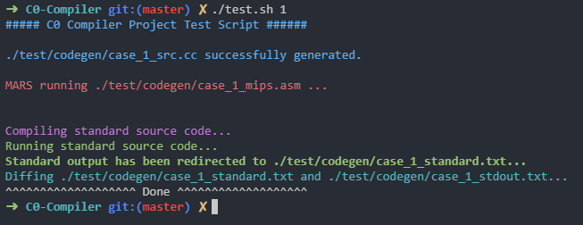

# BUAA-Compiler-Judger
  - A small test script (Compile + Run on MARS + Generate equivalent cpp code &amp; standard output + Diff result) for BUAA Compiler course fall19+.

## Enviroment
  - Ubuntu 18.04 (WSL)
  - clang 6.0.0
  
## How to use
  - Copy `redefio.h` and `test.sh` to the appropriate position, make sure you have the same directory structure (run `tree`) as below:
    ```
    <your working directory>
    │
    ├── lib
    │   └── Mars_Compiler.jar
    ├── test
    │   └── codegen
    │       └── redefio.h
    └── test.sh
    ```
  - Run `./test.sh [<case id>]` (It'd only take a few sec :)
    

## TODO
  - Add `syscall` type checking and counting.
  - Update diff part.
  - Add security branches.

## License
  - GPL v3.0